# Car Rental Management API
## Complete Technical Documentation

**Version:** 1.0  
**Framework:** .NET 8  
**Architecture:** Clean Architecture  
**Database:** SQLite (Production-ready for SQL Server/PostgreSQL)

---

## Table of Contents

1. [Executive Summary](#1-executive-summary)
2. [System Architecture](#2-system-architecture)
3. [Database Schema](#3-database-schema)
4. [Authentication Flow](#4-authentication-flow)
5. [API Endpoints Reference](#5-api-endpoints-reference)
6. [Business Workflows](#6-business-workflows)
7. [Deployment Guide](#7-deployment-guide)

---

## 1. Executive Summary

### 1.1 Project Overview

The **Car Rental Management API** is a comprehensive backend solution designed for car rental businesses to manage their fleet, customers, bookings, and payments efficiently. Built with .NET 8 and Clean Architecture principles, it provides a scalable, maintainable, and secure platform.

### 1.2 Key Business Goals

- **Fleet Management**: Track and manage vehicle inventory with real-time availability
- **Customer Management**: Maintain customer profiles with driver validation
- **Booking Automation**: Handle reservations with conflict detection
- **Payment Processing**: Support multiple payment methods with transaction tracking
- **Role-Based Access**: Separate interfaces for Admin, Staff, and Customers
- **Scalability**: Handle growing business needs with minimal changes

### 1.3 Technical Highlights

| Feature | Implementation |
|---------|----------------|
| Architecture | Clean Architecture (4 layers) |
| Framework | .NET 8 with ASP.NET Core |
| Database | Entity Framework Core with SQLite |
| Authentication | JWT Bearer Tokens |
| Validation | FluentValidation |
| Logging | Serilog (Console + File) |
| Documentation | Swagger/OpenAPI |
| Security | BCrypt password hashing |

---

## 2. System Architecture

### 2.1 Clean Architecture Overview

The application follows Clean Architecture principles with four distinct layers, ensuring separation of concerns and testability.

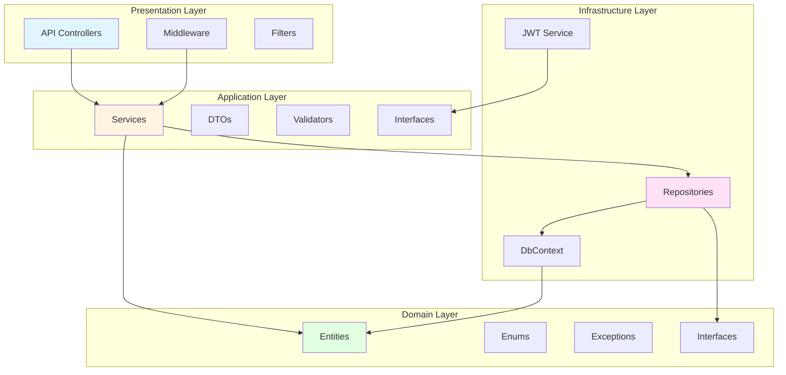

### 2.2 Layer Responsibilities

#### Domain Layer (CarRental.Domain)
**Purpose**: Core business entities and rules

**Components**:
- **Entities**: `Car`, `User`, `Rental`, `Payment`
- **Enums**: `UserRole`, `CarStatus`, `RentalStatus`, `PaymentMethod`, `PaymentStatus`, `CarCategory`
- **Interfaces**: `IRepository<T>`, `IUnitOfWork`, `ICarRepository`, `IUserRepository`, etc.
- **Exceptions**: Custom business exceptions

**Dependencies**: None (pure business logic)

#### Application Layer (CarRental.Application)
**Purpose**: Application business logic and use cases

**Components**:
- **Services**: `AuthService`, `CarService`, `UserService`, `RentalService`, `PaymentService`
- **Interfaces**: Service contracts
- **DTOs**: Request/Response models
- **Validators**: FluentValidation rules
- **Common**: Result patterns, pagination

**Dependencies**: Domain layer only

#### Infrastructure Layer (CarRental.Infrastructure)
**Purpose**: External systems and data persistence

**Components**:
- **DbContext**: Entity Framework Core configuration
- **Repositories**: Data access implementations
- **Services**: `JwtTokenService`
- **Data Seeding**: Initial data setup

**Dependencies**: Domain and Application layers

#### API Layer (CarRental.API)
**Purpose**: HTTP/REST endpoints and request handling

**Components**:
- **Controllers**: API endpoints for each resource
- **Middleware**: Global exception handling
- **Filters**: Validation filter
- **Configuration**: DI setup, CORS, JWT, Swagger

**Dependencies**: All layers

### 2.3 Request Processing Flow

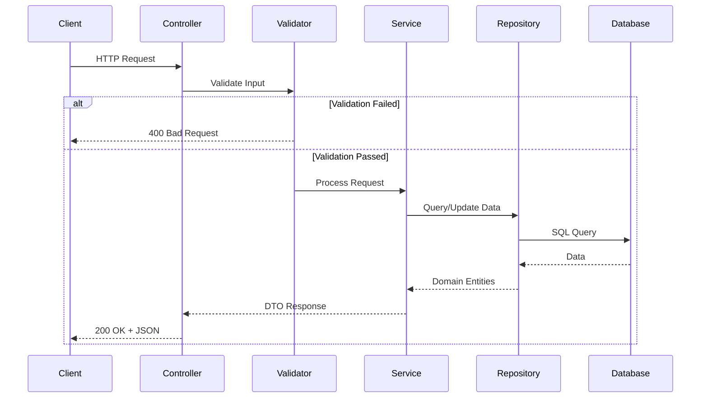

### 2.4 Dependency Injection Flow

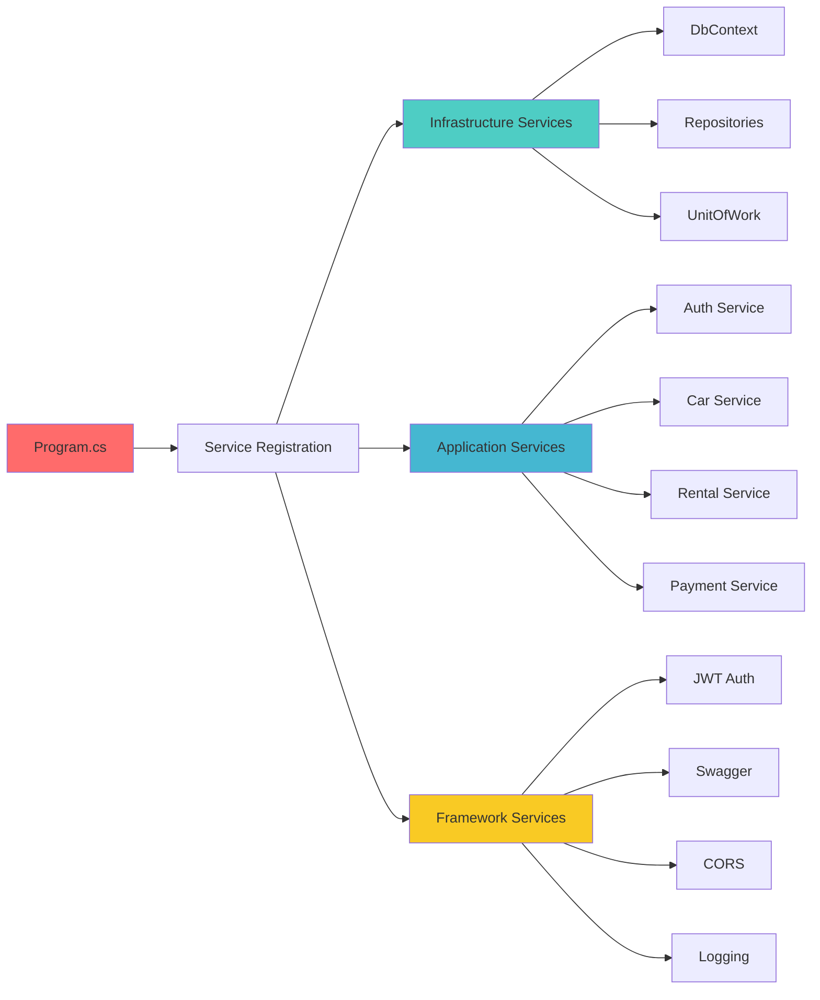

---

## 3. Database Schema

### 3.1 Entity Relationship Diagram

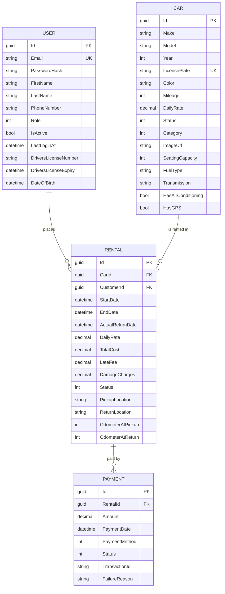

### 3.2 Entity Details

#### User Entity
```csharp
public class User : BaseEntity
{
    public string Email { get; set; }           // Unique, required
    public string PasswordHash { get; set; }    // BCrypt hashed
    public string FirstName { get; set; }
    public string LastName { get; set; }
    public string PhoneNumber { get; set; }
    public UserRole Role { get; set; }          // Admin, Staff, Customer
    public bool IsActive { get; set; }
    public DateTime? LastLoginAt { get; set; }
    
    // Driver information
    public string? DriversLicenseNumber { get; set; }
    public DateTime? DriversLicenseExpiry { get; set; }
    public DateTime? DateOfBirth { get; set; }
    
    // Address
    public string? Street { get; set; }
    public string? City { get; set; }
    public string? State { get; set; }
    public string? PostalCode { get; set; }
    public string? Country { get; set; }
}
```

**Business Rules**:
- Email must be unique and valid
- Password must meet complexity requirements
- Only active users can login
- Admin can manage all resources

#### Car Entity
```csharp
public class Car : BaseEntity
{
    public string Make { get; set; }
    public string Model { get; set; }
    public int Year { get; set; }
    public string LicensePlate { get; set; }    // Unique
    public string Color { get; set; }
    public int Mileage { get; set; }
    public decimal DailyRate { get; set; }
    public CarStatus Status { get; set; }       // Available, Rented, etc.
    public CarCategory Category { get; set; }   // Economy, Luxury, etc.
    public string? ImageUrl { get; set; }
    public string? Description { get; set; }
    public int SeatingCapacity { get; set; }
    public string FuelType { get; set; }
    public string Transmission { get; set; }
    public bool HasAirConditioning { get; set; }
    public bool HasGPS { get; set; }
}
```

**Business Rules**:
- License plate must be unique
- Cannot be deleted if has active rentals
- Status changes automatically with rental lifecycle

#### Rental Entity
```csharp
public class Rental : BaseEntity
{
    public Guid CarId { get; set; }
    public Guid CustomerId { get; set; }
    public DateTime StartDate { get; set; }
    public DateTime EndDate { get; set; }
    public DateTime? ActualReturnDate { get; set; }
    public decimal DailyRate { get; set; }
    public decimal TotalCost { get; set; }
    public decimal? LateFee { get; set; }
    public decimal? DamageCharges { get; set; }
    public RentalStatus Status { get; set; }
    public string? PickupLocation { get; set; }
    public string? ReturnLocation { get; set; }
    public int? OdometerAtPickup { get; set; }
    public int? OdometerAtReturn { get; set; }
    
    // Computed properties
    public int RentalDays => (EndDate - StartDate).Days + 1;
}
```

**Business Rules**:
- Cannot create rental for car that's already booked
- Total cost calculated as: DailyRate × RentalDays
- Late fees applied if ActualReturnDate > EndDate

#### Payment Entity
```csharp
public class Payment : BaseEntity
{
    public Guid RentalId { get; set; }
    public decimal Amount { get; set; }
    public DateTime PaymentDate { get; set; }
    public PaymentMethod PaymentMethod { get; set; }
    public PaymentStatus Status { get; set; }
    public string? TransactionId { get; set; }
    public string? FailureReason { get; set; }
}
```

**Business Rules**:
- Payment must be linked to a rental
- Cannot delete completed payments
- Track transaction IDs for reconciliation

---

## 4. Authentication Flow

### 4.1 Registration Process

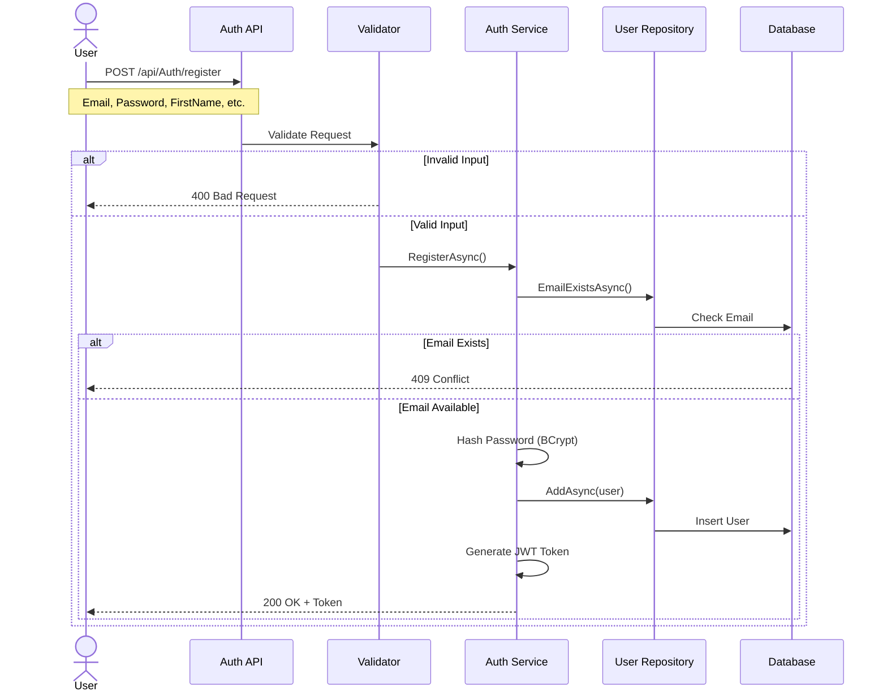

### 4.2 Login Process

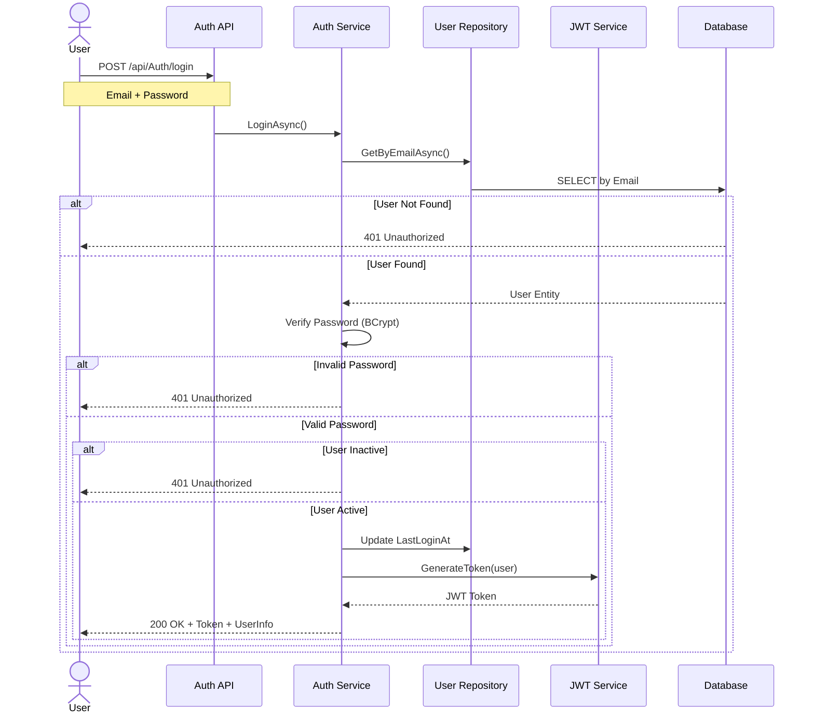

### 4.3 JWT Token Structure

```json
{
  "header": {
    "alg": "HS256",
    "typ": "JWT"
  },
  "payload": {
    "sub": "user-id-guid",
    "email": "user@example.com",
    "role": "Customer",
    "exp": "1737964800",
    "iss": "CarRentalAPI",
    "aud": "CarRentalClients"
  }
}
```

### 4.4 Protected Endpoint Access

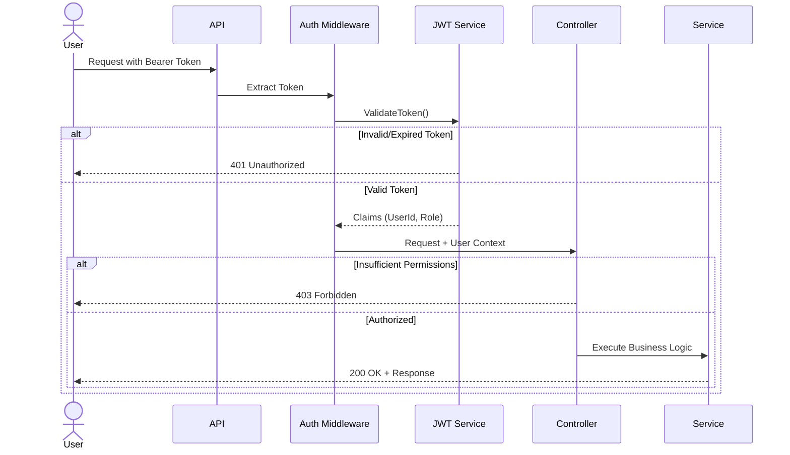

---

## 5. API Endpoints Reference

### 5.1 Authentication Endpoints

#### Register New User
**Endpoint**: `POST /api/Auth/register`  
**Authentication**: None  
**Request Body**:
```json
{
  "email": "user@example.com",
  "password": "SecurePass123!",
  "firstName": "John",
  "lastName": "Doe",
  "phoneNumber": "+1234567890"
}
```

**Response (200 OK)**:
```json
{
  "success": true,
  "data": {
    "token": "eyJhbGciOiJIUzI1NiIsInR5cCI6IkpXVCJ9...",
    "tokenType": "Bearer",
    "expiresAt": "2024-01-27T10:00:00Z",
    "userId": "550e8400-e29b-41d4-a716-446655440000",
    "email": "user@example.com",
    "fullName": "John Doe",
    "role": "Customer"
  }
}
```

**Validation Rules**:
- Email: Required, valid format, unique
- Password: Minimum 8 characters, at least one uppercase, one lowercase, one digit
- FirstName/LastName: Required, 2-50 characters
- PhoneNumber: Required, valid format

---

#### Login
**Endpoint**: `POST /api/Auth/login`  
**Authentication**: None  
**Request Body**:
```json
{
  "email": "admin@carrental.com",
  "password": "Admin123!"
}
```

**Response (200 OK)**:
```json
{
  "success": true,
  "data": {
    "token": "eyJhbGciOiJIUzI1NiIsInR5cCI6IkpXVCJ9...",
    "tokenType": "Bearer",
    "expiresAt": "2024-01-27T10:00:00Z",
    "userId": "11111111-1111-1111-1111-111111111111",
    "email": "admin@carrental.com",
    "fullName": "System Admin",
    "role": "Admin"
  }
}
```

**Error Responses**:
- `401 Unauthorized`: Invalid credentials or inactive account

---

#### Refresh Token
**Endpoint**: `POST /api/Auth/refresh`  
**Authentication**: Required (expired token accepted)  
**Request Body**:
```json
{
  "token": "eyJhbGciOiJIUzI1NiIsInR5cCI6IkpXVCJ9..."
}
```

**Response (200 OK)**: New token with extended expiration

---

### 5.2 Car Management Endpoints

#### Get All Cars
**Endpoint**: `GET /api/Cars?pageNumber=1&pageSize=10`  
**Authentication**: None  
**Query Parameters**:
- `pageNumber` (optional): Page number (default: 1)
- `pageSize` (optional): Items per page (default: 10, max: 100)

**Response (200 OK)**:
```json
{
  "success": true,
  "data": {
    "items": [
      {
        "id": "33333333-3333-3333-3333-333333333333",
        "make": "Toyota",
        "model": "Camry",
        "year": 2024,
        "licensePlate": "ABC-1234",
        "color": "Silver",
        "dailyRate": 45.00,
        "status": "Available",
        "category": "Standard",
        "seatingCapacity": 5,
        "transmission": "Automatic",
        "hasAirConditioning": true
      }
    ],
    "pageNumber": 1,
    "pageSize": 10,
    "totalPages": 1,
    "totalCount": 3
  }
}
```

---

#### Get Available Cars
**Endpoint**: `GET /api/Cars/available?startDate=2024-01-26T10:00&endDate=2024-01-28T10:00`  
**Authentication**: None  
**Query Parameters**:
- `startDate`: Rental start date (ISO 8601)
- `endDate`: Rental end date (ISO 8601)

**Response**: List of cars not booked for the specified period

---

#### Create Car
**Endpoint**: `POST /api/Cars`  
**Authentication**: Required (Admin/Staff only)  
**Request Body**:
```json
{
  "make": "Honda",
  "model": "Civic",
  "year": 2024,
  "licensePlate": "XYZ-789",
  "color": "Blue",
  "mileage": 0,
  "dailyRate": 40.00,
  "category": 2,
  "description": "Fuel-efficient compact car",
  "seatingCapacity": 5,
  "fuelType": "Gasoline",
  "transmission": "Automatic",
  "hasAirConditioning": true,
  "hasGPS": true
}
```

**Validation Rules**:
- LicensePlate: Unique, required
- DailyRate: Greater than 0
- Year: Between 1900 and current year + 1
- Category: Valid enum value (0-5)

---

#### Update Car
**Endpoint**: `PUT /api/Cars/{id}`  
**Authentication**: Required (Admin/Staff only)  
**Request Body**: Same as Create Car

---

#### Delete Car
**Endpoint**: `DELETE /api/Cars/{id}`  
**Authentication**: Required (Admin only)  
**Response**: 204 No Content (success) or 400 if car has active rentals

---

### 5.3 Rental Management Endpoints

#### Create Rental
**Endpoint**: `POST /api/Rentals`  
**Authentication**: Required  
**Request Body**:
```json
{
  "carId": "33333333-3333-3333-3333-333333333333",
  "startDate": "2024-01-26T10:00:00",
  "endDate": "2024-01-28T10:00:00",
  "pickupLocation": "Main Office - Downtown",
  "returnLocation": "Main Office - Downtown"
}
```

**Response (201 Created)**:
```json
{
  "success": true,
  "data": {
    "id": "rental-id-guid",
    "carId": "33333333-3333-3333-3333-333333333333",
    "customerId": "customer-id",
    "startDate": "2024-01-26T10:00:00",
    "endDate": "2024-01-28T10:00:00",
    "dailyRate": 45.00,
    "totalCost": 135.00,
    "status": "Pending",
    "pickupLocation": "Main Office - Downtown",
    "returnLocation": "Main Office - Downtown"
  }
}
```

**Business Logic**:
1. Check car availability for date range
2. Calculate total cost: DailyRate × (EndDate - StartDate).Days
3. Set status to "Pending"
4. Update car status to "Rented" (on confirmation)

---

#### Get Rental by ID
**Endpoint**: `GET /api/Rentals/{id}`  
**Authentication**: Required  
**Authorization**: Customers can only view their own rentals

---

#### Update Rental Status
**Endpoint**: `PUT /api/Rentals/{id}/status`  
**Authentication**: Required (Staff/Admin)  
**Request Body**:
```json
{
  "status": 2,
  "actualReturnDate": "2024-01-28T15:00:00",
  "odometerAtReturn": 12550,
  "damageCharges": 0,
  "notes": "Car returned in good condition"
}
```

**Status Codes**:
- 0: Pending
- 1: Active
- 2: Completed
- 3: Cancelled

---

#### Cancel Rental
**Endpoint**: `DELETE /api/Rentals/{id}`  
**Authentication**: Required  
**Business Logic**:
- Customers can only cancel "Pending" rentals
- Staff/Admin can cancel "Pending" or "Active" rentals
- Cannot cancel "Completed" rentals
- Car status reverts to "Available"

---

### 5.4 Payment Endpoints

#### Create Payment
**Endpoint**: `POST /api/Payments`  
**Authentication**: Required  
**Request Body**:
```json
{
  "rentalId": "rental-id-guid",
  "amount": 135.00,
  "paymentMethod": 1,
  "transactionId": "TXN-20240126-001"
}
```

**Payment Methods**:
- 0: CreditCard
- 1: DebitCard
- 2: Cash
- 3: BankTransfer

**Response (201 Created)**:
```json
{
  "success": true,
  "data": {
    "id": "payment-id-guid",
    "rentalId": "rental-id-guid",
    "amount": 135.00,
    "paymentDate": "2024-01-26T10:30:00",
    "paymentMethod": "DebitCard",
    "status": "Completed",
    "transactionId": "TXN-20240126-001"
  }
}
```

---

### 5.5 User Management Endpoints

#### Get User Profile
**Endpoint**: `GET /api/Users/profile`  
**Authentication**: Required  
**Response**: Current user's profile information

---

#### Update User Profile
**Endpoint**: `PUT /api/Users/profile`  
**Authentication**: Required  
**Request Body**:
```json
{
  "firstName": "John",
  "lastName": "Doe",
  "phoneNumber": "+1234567890",
  "street": "123 Main St",
  "city": "New York",
  "state": "NY",
  "postalCode": "10001",
  "country": "USA",
  "driversLicenseNumber": "D1234567",
  "driversLicenseExpiry": "2028-12-31",
  "dateOfBirth": "1990-05-15"
}
```

---

## 6. Business Workflows

### 6.1 Complete Rental Workflow

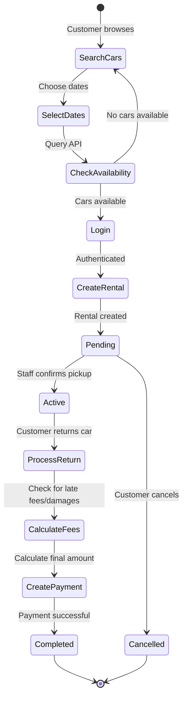

### 6.2 Payment Processing Flow

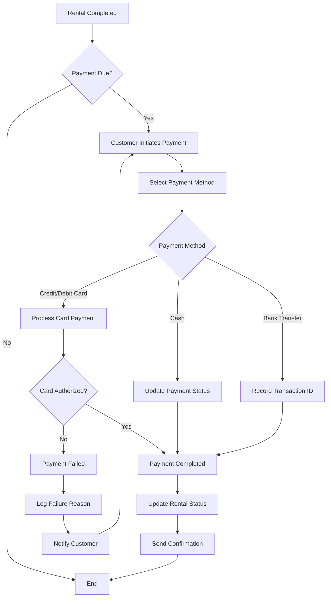

### 6.3 Car Availability Check

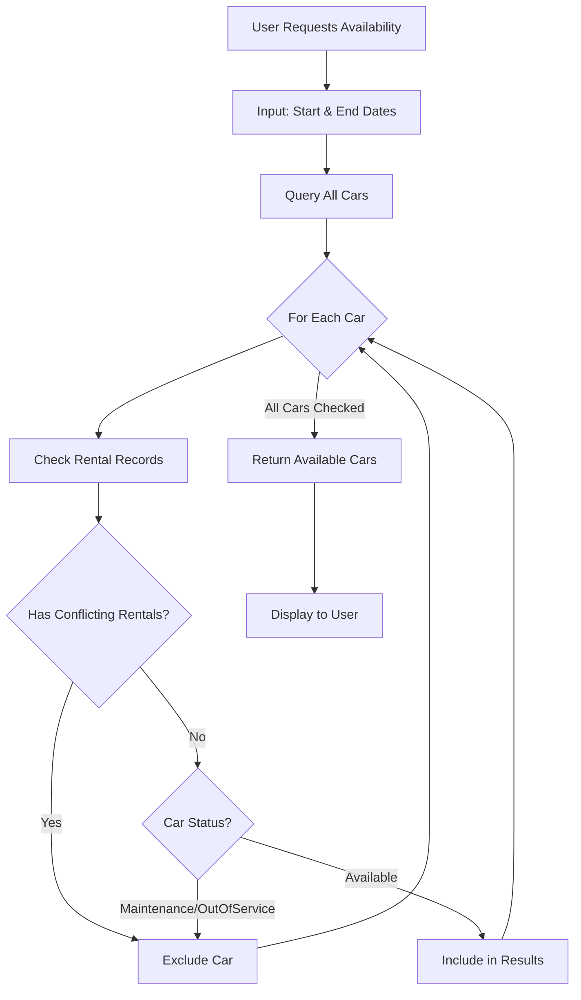

### 6.4 Late Fee Calculation

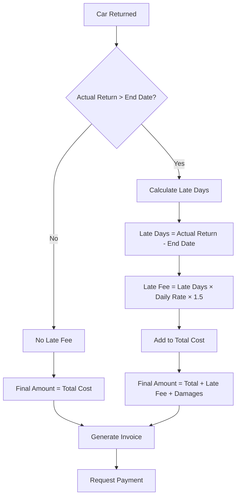

---

## 7. Deployment Guide

### 7.1 Local Development Setup

```bash
# 1. Clone the repository
cd /Users/prashantkumar/Desktop/CarRental-backend

# 2. Restore dependencies
dotnet restore

# 3. Build the solution
dotnet build

# 4. Run the API
dotnet run --project src/CarRental.API/CarRental.API.csproj

# 5. Access Swagger
# Open browser to: http://localhost:5000/swagger
```

### 7.2 Production Deployment

#### Configuration for Production

**appsettings.Production.json**:
```json
{
  "ConnectionStrings": {
    "DefaultConnection": "Server=prod-server;Database=CarRental;User Id=sa;Password=****;"
  },
  "Jwt": {
    "Key": "*** SECURE KEY FROM ENVIRONMENT ***",
    "Issuer": "CarRentalAPI",
    "Audience": "CarRentalClients"
  },
  "Logging": {
    "LogLevel": {
      "Default": "Warning",
      "Microsoft.AspNetCore": "Warning"
    }
  }
}
```

#### Docker Deployment

```dockerfile
FROM mcr.microsoft.com/dotnet/sdk:8.0 AS build
WORKDIR /src
COPY . .
RUN dotnet restore
RUN dotnet publish -c Release -o /app

FROM mcr.microsoft.com/dotnet/aspnet:8.0
WORKDIR /app
COPY --from=build /app .
EXPOSE 80
ENTRYPOINT ["dotnet", "CarRental.API.dll"]
```

### 7.3 Environment Variables

| Variable | Description | Example |
|----------|-------------|---------|
| `ASPNETCORE_ENVIRONMENT` | Environment name | Production |
| `JWT_KEY` | JWT signing key | 256-bit secret |
| `DB_CONNECTION` | Database connection | ConnectionString |
| `CORS_ORIGINS` | Allowed CORS origins | https://app.com |

---

## Appendix A: Error Codes

| HTTP Code | Error Type | Description |
|-----------|------------|-------------|
| 400 | Bad Request | Validation failed |
| 401 | Unauthorized | Invalid or missing token |
| 403 | Forbidden | Insufficient permissions |
| 404 | Not Found | Resource doesn't exist |
| 409 | Conflict | Duplicate resource |
| 500 | Server Error | Internal error |

---

## Appendix B: Default Test Accounts

### Admin Account
- **Email**: admin@carrental.com
- **Password**: Admin123!
- **Permissions**: Full access

### Customer Account
- **Email**: customer@example.com
- **Password**: Customer123!
- **Permissions**: View cars, create rentals, manage own profile

---

**Document Version**: 1.0  
**Last Updated**: January 26, 2024  
**Contact**: support@carrental.com
