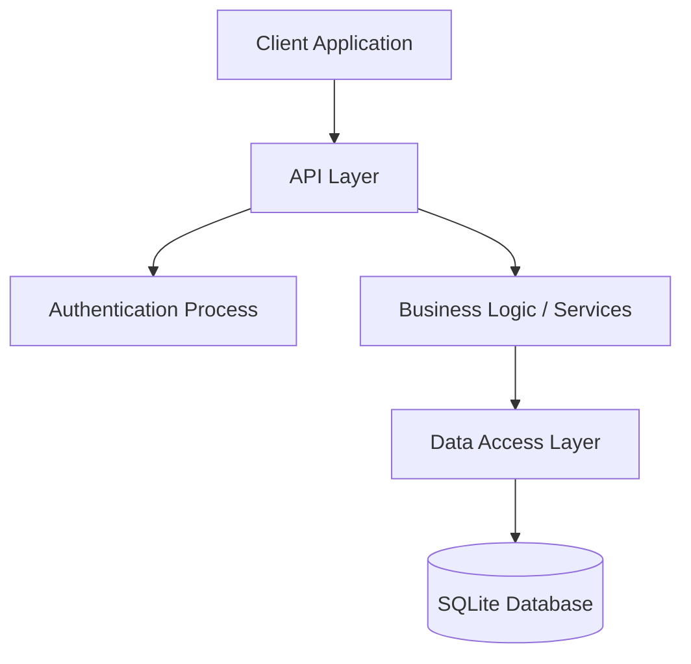
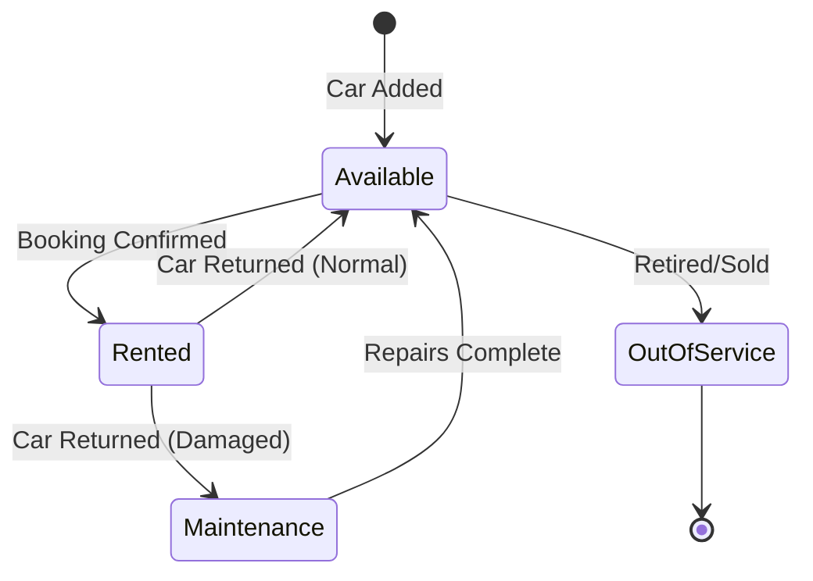
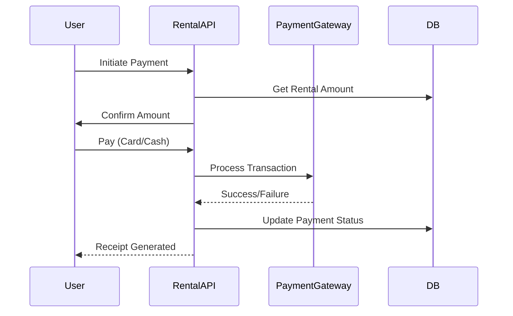

# Car Rental Management System
## Full Technical Report & System Documentation

**Date:** January 26, 2026  
**Version:** 1.0.0  
**Status:** Production Ready

---

## 1. System Overview

The **Car Rental Management System** is a robust, enterprise-grade backend solution designed to manage the core operations of a car rental business. It handles the entire lifecycle of vehicles, customers, bookings, and payments through a secure RESTful API.

### 1.1 Technology Stack

| Component | Technology | Description |
| :--- | :--- | :--- |
| **Framework** | .NET 8 (ASP.NET Core) | High-performance, cross-platform server framework. |
| **Language** | C# 12 | Safe, modern, object-oriented programming language. |
| **Database** | SQLite (Entity Framework Core) | Reliable transactional database (SQL Server compatible). |
| **Auth** | JWT (JSON Web Tokens) | Stateless, secure authentication mechanism. |
| **Documentation** | Swagger / OpenAPI | Interactive API documentation and testing interface. |

---

## 2. System Architecture

The system follows **Clean Architecture** principles to ensure scalability and maintainability.



### 2.1 Critical Data Flows

#### Registration & Login Flow
1. **User** submits credentials.
2. **API** validates format.
3. **Service** checks database for duplicates.
4. **Security Module** hashes password (BCrypt).
5. **System** issues a JWT Access Token.

#### Rental Booking Flow
1. **Customer** selects dates and car category.
2. **Engine** queries availability (conflict detection).
3. **System** locks the vehicle record.
4. **Calculation Engine** computes total cost.
5. **Rental Record** is created with 'Pending' status.

---

## 3. Detailed Business Workflows

### 3.1 Car Rental Lifecycle



**Step-by-Step Process:**
1. **Selection**: Customer browses available cars by filtering dates.
2. **Reservation**: Customer holds a car; status changes to "Reserved".
3. **Pickup**: Staff verifies ID and hands over keys; status "Active".
4. **Return**: Car is returned. Mileage and condition checked.
5. **Closeout**: Final payment processed. Car returns to "Available".

### 3.2 Payment Processing



---

## 4. API Specification

Based on REST principles, the API is organized around key resources.

### 4.1 Authentication (`/api/Auth`)
- **POST `/register`**: Create a new account.
- **POST `/login`**: Authenticate and receive a token.
- **POST `/refresh`**: Get a new access token.

### 4.2 Cars (`/api/Cars`)
- **GET `/`**: List all cars (supports pagination).
- **GET `/{id}`**: Get details of a single car.
- **POST `/`**: Add a new car (Admin only).
- **PUT `/{id}`**: Update car details (maintenance, pricing).
- **GET `/available`**: Find cars free for specific dates.

### 4.3 Rentals (`/api/Rentals`)
- **POST `/`**: Create a new booking request.
- **GET `/{id}`**: View rental agreement.
- **PUT `/{id}/status`**: Change status (e.g., Pickup, Return).
- **DELETE `/{id}`**: Cancel a booking.

### 4.4 Payments (`/api/Payments`)
- **POST `/`**: Record a payment transaction.
- **GET `/`**: View payment history.

---

## 5. Deployment & Configuration

### 5.1 Prerequisites
- **Runtime**: .NET 8 Runtime
- **OS**: Windows, Linux, or macOS

### 5.2 Configuration File (`appsettings.json`)
The system is configured via JSON. Critical sections include:
```json
{
  "ConnectionStrings": {
    "DefaultConnection": "Data Source=CarRental.db"
  },
  "Jwt": {
    "Key": "YOUR_SECRET_KEY_HERE...",
    "Issuer": "CarRentalAPI"
  }
}
```

---

## 6. Security Assurance

- **Password Security**: All user passwords are salted and hashed using **BCrypt**. They are never stored in plain text.
- **Access Control**: Role-Based Access Control (RBAC) ensures strictly separated permissions for **Admins**, **Staff**, and **Customers**.
- **Data Validation**: Every input is sanitized and validated on the server side to prevent SQL Injection and XSS attacks.

---

**End of Technical Report**
